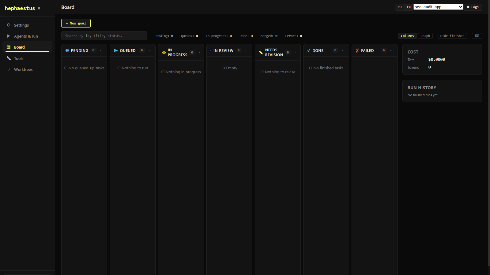

# HEPHAESTUS — Autonomous Development Loop

[](https://github.com/starsinc1708/HEPHAESTUS/actions/workflows/hephaestus-loop-ci.yml)
[](LICENSE)


> Self-hosted, open-source tool that turns development goals into shipped code.
> Define a goal → HEPHAESTUS decomposes it, executes tasks via AI agents, verifies results, and merges clean commits.



> The dashboard UI ships in English and Russian (toggle in the top bar).

## What It Does

HEPHAESTUS is an autonomous development loop: you give it a goal (e.g. "implement user auth"),
and it:

1. **Decomposes** the goal into discrete tasks
2. **Executes** each task using an AI agent (opencode, Claude, Codex)
3. **Verifies** results (typecheck, lint, tests)
4. **Commits** to an isolated feature branch

A web dashboard shows live progress of every task, iteration, and agent run.

## Architecture

```
┌──────────────┐     ┌──────────────────┐     ┌─────────────────┐
│  Vue 3 SPA   │────▶│  FastAPI Backend  │────▶│  AI Agent CLI   │
│  (dashboard)  │◀────│  (orchestrator)   │◀────│  (opencode/etc) │
└──────────────┘     └──────────────────┘     └─────────────────┘
       │                     │
       │              ┌──────┴──────┐
       │              │   state/    │
       │              │  (JSON FS)  │
       └──────────────┴─────────────┘
```

| Layer | Stack | Key files |
|-------|-------|-----------|
| **Backend** | FastAPI + Python 3.11+, `mypy --strict`, `ruff` | `backend/app/` |
| **Frontend** | Vue 3 + TypeScript + Pinia + Tailwind CSS | `frontend/src/` |
| **Orchestrator** | 9-phase FSM (finite state machine) | `backend/app/orchestrator/fsm.py` |
| **State** | File-based JSON (no database) | `state/` |
| **Agents** | opencode, Claude CLI, Codex CLI | via `backend/app/services/opencode_runner.py` |

### FSM Pipeline

Each task goes through these phases:

```
preflight → prompt → execute → verify → commit → idle
                         ↑         │
                         └── retry ┘
```

- **Verify funnel**: typecheck → lint → tests must all pass before commit
- **Tier review**: multi-agent review with configurable approval thresholds
- **Branch isolation**: every iteration works on `auto/<task-id>-<sha>` — never touches `main`

## Quick Start

### Option A — Docker (dashboard + API in one command)

```bash
git clone https://github.com/starsinc1708/HEPHAESTUS.git
cd HEPHAESTUS
docker compose up --build      # then open http://localhost:8765
```

This serves the dashboard, API, and review/merge UI. To run the autonomous loop you
also need the agent CLIs (opencode / Claude / Codex) available to the process — see the
note in the `Dockerfile`. **Read [SECURITY.md](SECURITY.md) before pointing HEPHAESTUS at a
repository:** agents execute code with the container user's privileges.

### Option B — from source (~15 minutes to first run)

```bash
# 1. Clone
git clone https://github.com/starsinc1708/HEPHAESTUS.git
cd HEPHAESTUS

# 2. Backend
cd backend
cp .env.example .env          # edit paths in .env
uv sync                       # install Python deps
uvicorn app.main:app          # starts on http://localhost:8766

# 3. Frontend (new terminal)
cd frontend
pnpm install
pnpm dev                      # starts on http://localhost:5173 (proxies API to :8766)

# 4. Open http://localhost:5173 — the onboarding wizard will guide you
```

For detailed setup, troubleshooting, and platform-specific instructions, see **[GETTING_STARTED.md](GETTING_STARTED.md)**.

## Configuration

Configuration is via environment variables. Copy and edit the example:

```bash
cp backend/.env.example backend/.env
```

Key variables:

| Variable | Default | Description |
|----------|---------|-------------|
| `HEPHAESTUS_LOOP_HOME` | (auto-detected) | Path to this repo |
| `HEPHAESTUS_REPO` | `""` | Target git repository path |
| `HEPHAESTUS_DASHBOARD_PORT` | `8766` | Backend API port |
| `HEPHAESTUS_DASHBOARD_HOST` | `127.0.0.1` | Backend bind address |
| `HEPHAESTUS_DASHBOARD_PASSWORD` | (none) | Set to enable auth |
| `HEPHAESTUS_PRIMARY_AGENT` | `sisyphus` | Primary AI agent |
| `HEPHAESTUS_FALLBACK_AGENT` | `atlas` | Fallback agent on failure |
| `HEPHAESTUS_MAX_ITER` | `50` | Max iterations per run |
| `HEPHAESTUS_MAX_PARALLEL` | `1` | Parallel task limit |
| `HEPHAESTUS_AUTOPUSH` | `off` | Auto-push feature branches |
| `HEPHAESTUS_TIER_REVIEW` | `on` | Multi-agent review system |

Full list in `backend/.env.example`. Can also be overridden via the dashboard Settings page
or `state/config.json`.

## Guardrails

| Guardrail | Default |
|-----------|---------|
| Branch isolation: every iter creates `auto/<task-id>-<sha>` | always on |
| **Never** pushes to `main` | always on |
| Per-iteration hard timeout | `2400s` (40 min) |
| Max iterations per run | `50` |
| Stop after N consecutive failures | `4` |
| Verify (typecheck + lint + tests) must pass to commit | always on |
| Working tree reset on verify failure | always on |
| Primary → fallback agent on failure | always on |
| Kill switch: `state/stop` file | always on |

## Supported AI Engines

HEPHAESTUS works with multiple AI agent CLIs:

| Engine | CLI | Notes |
|--------|-----|-------|
| **opencode** | `opencode` | Primary engine, supports multiple providers |
| **Claude** | `claude` | Anthropic's Claude Code |
| **Codex** | `codex` | OpenAI's Codex CLI |

The onboarding wizard auto-detects installed CLIs.

### Provider Catalog

The backend supports 7 providers out of the box: Anthropic, OpenAI, DeepSeek, Google, Mistral, xAI, and custom endpoints.

## Project Structure

```
hephaestus-autonomous-loop/
├── backend/                   # FastAPI backend
│   ├── app/
│   │   ├── main.py            # App factory, auth, CORS, lifespan
│   │   ├── config.py          # Configuration & env vars
│   │   ├── api/v1/            # 79 HTTP endpoints, 3 WebSocket routes
│   │   ├── orchestrator/
│   │   │   └── fsm.py         # 9-phase FSM orchestrator
│   │   ├── core/              # State, git, events, queue, iterations
│   │   ├── models/            # Pydantic models
│   │   ├── services/          # Connections, agent runner, WebSocket
│   │   └── integrations/      # GitHub/GitLab integrations
│   ├── tests/                 # 100+ test files
│   ├── pyproject.toml         # Python deps & tool config
│   └── .env.example           # Environment variable template
├── frontend/                  # Vue 3 SPA
│   ├── src/
│   │   ├── views/             # Board, Agents, Tools, Settings, Worktrees
│   │   ├── components/        # 36 components including OnboardWizard
│   │   ├── stores/            # 7 Pinia stores
│   │   ├── api/client.ts      # API client
│   │   └── router.ts          # Routes
│   ├── vite.config.ts         # Dev proxy → backend :8766
│   └── package.json           # Node deps
├── prompts/                   # 19 prompt templates
├── state/                     # Runtime state (JSON, git-ignored)
└── docs/                      # Screenshots & assets
```

## API Documentation

Once the backend is running, interactive API docs are available:

- **Swagger UI**: http://localhost:8766/docs
- **ReDoc**: http://localhost:8766/redoc
- **OpenAPI JSON**: http://localhost:8766/openapi.json

## Documentation

| Doc | Description |
|-----|-------------|
| [GETTING_STARTED.md](GETTING_STARTED.md) | Detailed setup guide with troubleshooting |
| [CONTRIBUTING.md](CONTRIBUTING.md) | Development setup, code style, PR process |
| [SECURITY.md](SECURITY.md) | Security policy + threat model (read before running) |
| [CODE_OF_CONDUCT.md](CODE_OF_CONDUCT.md) | Community guidelines |
| [CHANGELOG.md](CHANGELOG.md) | Release notes |

## License

Released under the [MIT License](LICENSE).
